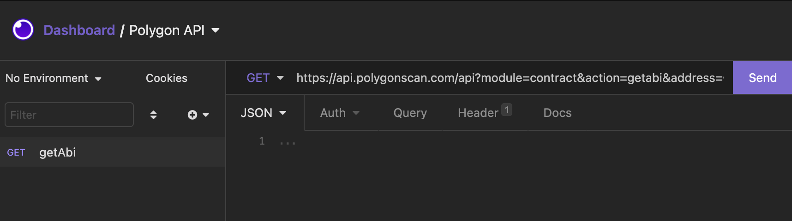
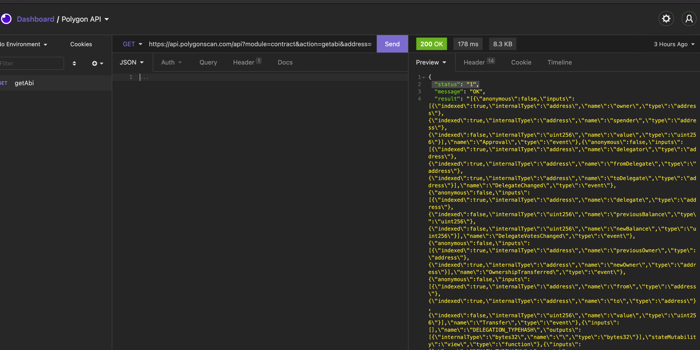
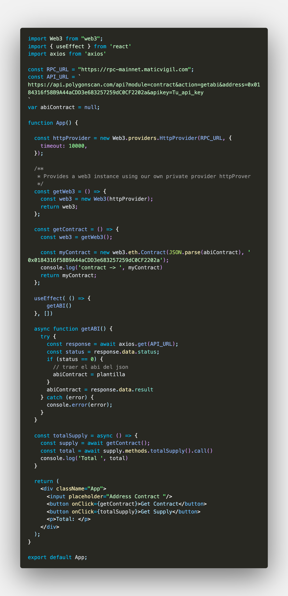

# Tutorial Basico de como interactuar con Smart contracts en la red de polygon desde un frontend con React

## Para este tutorial necesitas:
    * [NodeJS](https://nodejs.org/en/)
    * [MetaMask](https://chrome.google.com/webstore/detail/metamask/nkbihfbeogaeaoehlefnkodbefgpgknn?hl=en)
MetaMask es una wallet de Ethereum, actualmente la mayoria de los navegadores no se conectan a la red blockchain y esta wallet nos permite hacer esto.
    * [Cuenta en polygonscan](https://polygonscan.com/register)
    * [API_KEY](https://polygonscan.com/myapikey)

Creamos una aplicación en React con `npx create-react-app {nombre de tu app}` [Create React App](https://github.com/facebook/create-react-app).

En polygonscan nos dirijimos a la seccion de APIs y usaremos la api de [contracts](https://polygonscan.com/apis#contracts) Get Contract ABI for Verified Contract Source Codes

Usaré un cliente para probar la api, en este caso usré [insomnia](https://insomnia.rest/download), pero tambien puedes usar [postman](https://www.postman.com/).
 agrego la url en la barra para hacer una peticion
 `https://api.polygonscan.com/api?module=contract&action=getabi&address=0x0184316f58B9A44aCDD3e683257259dC0CF2202a&apikey=TuAPI_Key`

enviamos la peticion y recibimos como respuesta un objeto result con un abi.

una vez que tenemos una respuesta como esta, regresamos a nuestra app de react y desde la terminal instalaremos [web3.js](https://web3js.readthedocs.io/en/v1.5.2/getting-started.html) y [axios](https://www.npmjs.com/package/axios)  
una vez instaladas las librerias en nuestro archivo App.js importaremos y configuraremos las funciones necesarias  

en este codigo de ejemplo ejecutamos la funcion de `web3.eth.Contract` que nos servira para generar las funciones que tiene el contrato desde la respuesta de la api  
Una vez obtenidas las funciones del contrato creamos la funcion de totalSupply para ejecutar el metodo de total supply que viene dentro de las funciones del contrato y obtener el numero total de tokens minteados por el contrato
